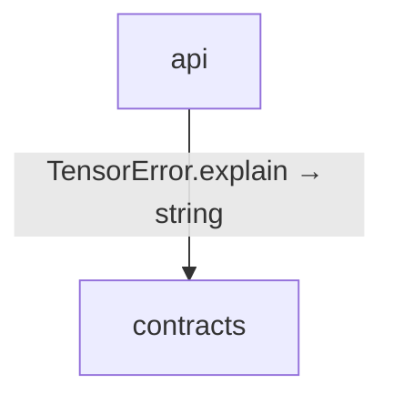

<!-- Generated by aug spec. Edit the August source, then regenerate. -->

# src data flow

[Project overview](../../index.md)

This view opens the src folder one level deeper. Each arrow shows the called operation and the data it returns to its caller. Calls inside a file stay in that file’s sequence view.

Data crossing these boundaries (2 contracts)

| From | To | Operation and inputs | Result |
| --- | --- | --- | --- |
| api | contracts | [TensorError](../../../../src/contracts.aug.md#symbol-TensorError) · code: int, message: string · value construction | TensorError |
| api | contracts | [TensorError.explain](../../../../src/contracts.aug.md#symbol-TensorError.explain) | string |

## Files in this folder

| Module | Read |
| --- | --- |
| src/api.aug | [Flow and sequences](../../../../src/api.aug.diagrams.md) · [Explanation](../../../../src/api.aug.md) |
| src/bindings.aug | [Flow and sequences](../../../../src/bindings.aug.diagrams.md) · [Explanation](../../../../src/bindings.aug.md) |
| src/contracts.aug | [Flow and sequences](../../../../src/contracts.aug.diagrams.md) · [Explanation](../../../../src/contracts.aug.md) |
| src/export.aug | [Flow and sequences](../../../../src/export.aug.diagrams.md) · [Explanation](../../../../src/export.aug.md) |
