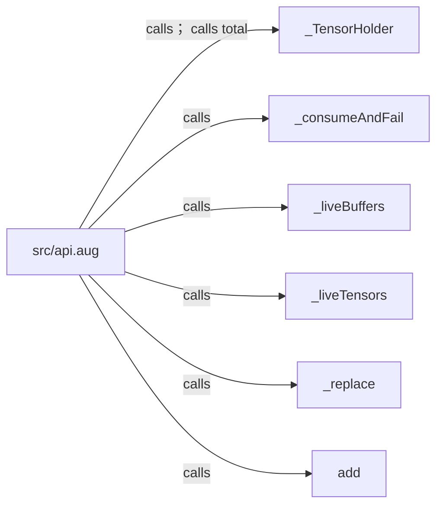
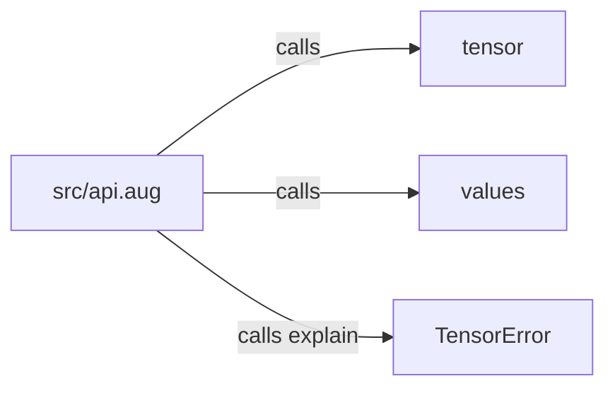
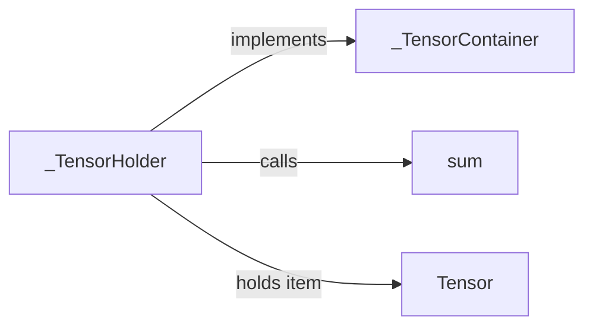
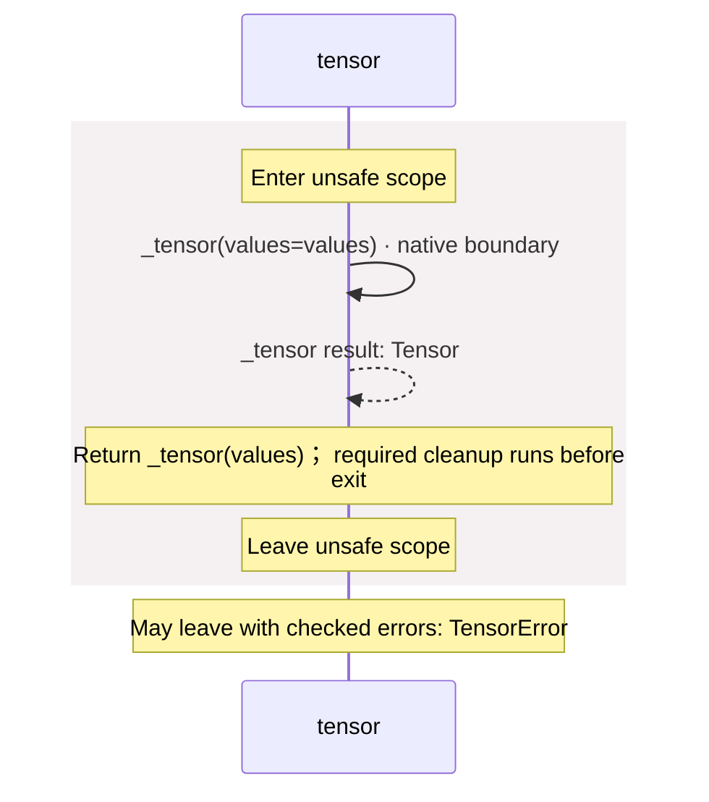
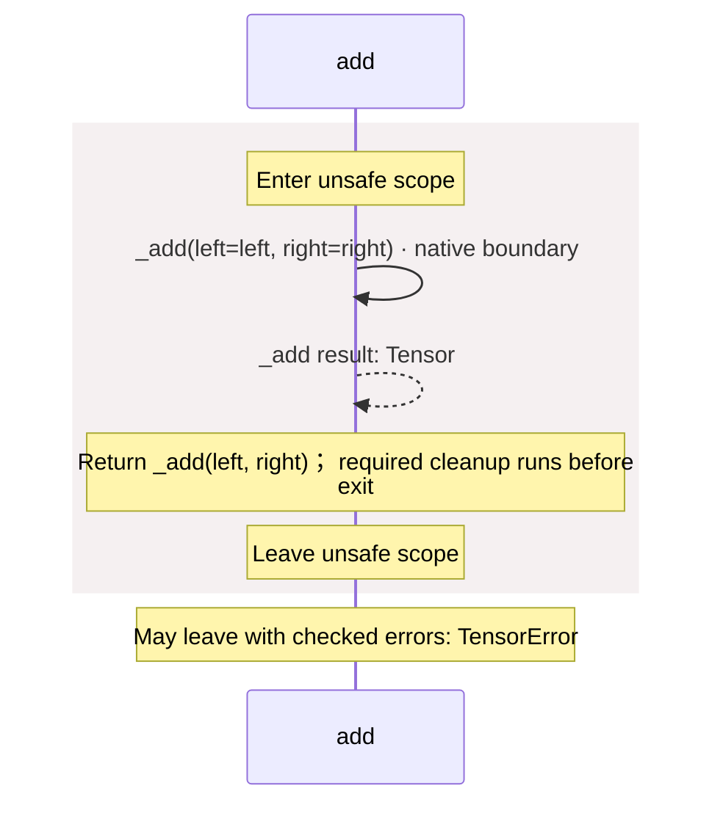
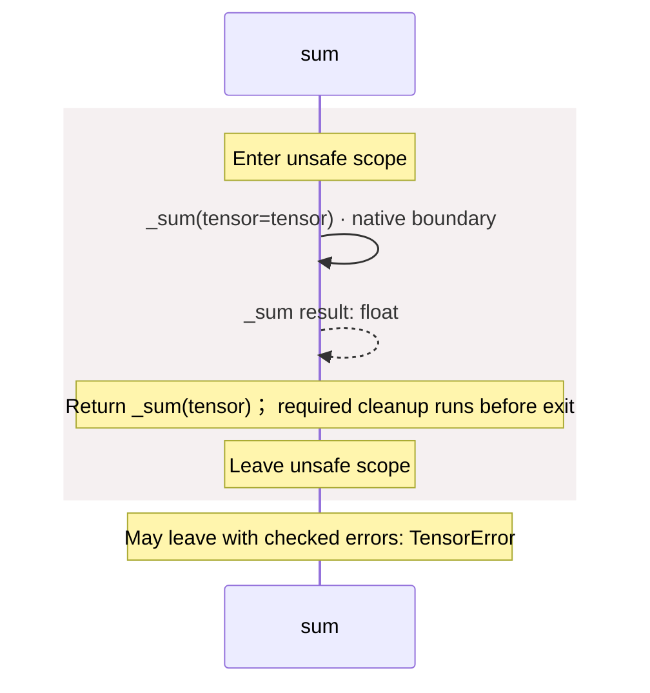
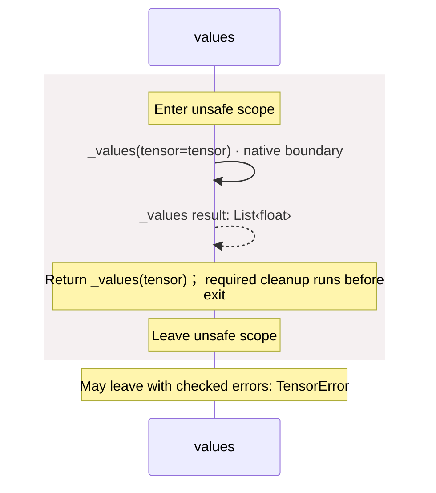
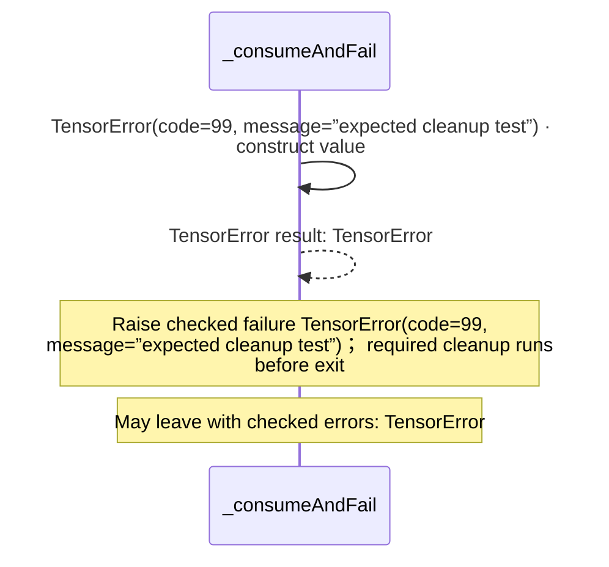
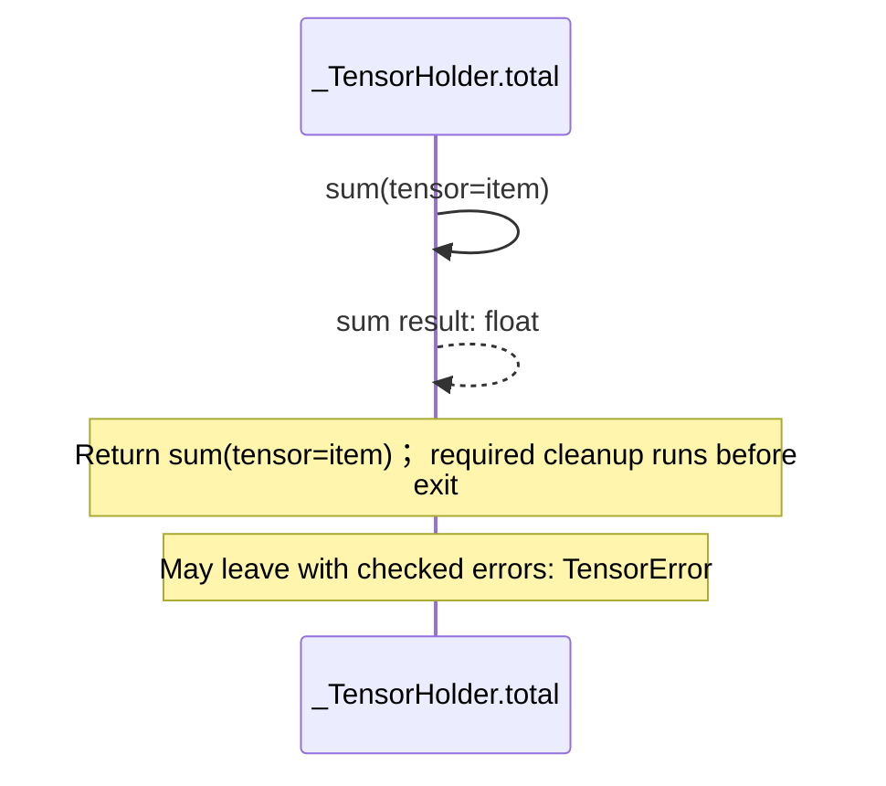

<!-- Generated by aug spec. Edit the August source, then regenerate. -->

# src/api.aug diagrams

[Project overview](../.aug-spec/diagrams/index.md) · [Compiled explanation](api.aug.md)

## Class interactions

### module:src/api.aug

#### View 1 of 2

#### View 2 of 2

### \_TensorHolder

## Sequences

Call arrows identify checked targets; loop and branch frames determine when they run. Open that target’s module to follow its implementation. Branches describe alternatives; loops describe repeated work. Native calls and interface dispatch stop at their declared contracts. Exit notes end that path; enclosing recovery and cleanup remain visible.

### \_tensor

[Source](api.aug#L4)

May leave with checked errors: TensorError. Native implementation; only the declared contract is known. [Explanation](api.aug.md).

### \_add

[Source](api.aug#L5)

May leave with checked errors: TensorError. Native implementation; only the declared contract is known. [Explanation](api.aug.md).

### \_sum

[Source](api.aug#L6)

May leave with checked errors: TensorError. Native implementation; only the declared contract is known. [Explanation](api.aug.md).

### \_values

[Source](api.aug#L7)

May leave with checked errors: TensorError. Native implementation; only the declared contract is known. [Explanation](api.aug.md).

### tensor

[Source](api.aug#L9)

### add

[Source](api.aug#L13)

### sum

[Source](api.aug#L17)

### values

[Source](api.aug#L21)

### \_liveTensors

[Source](api.aug#L25)

Native implementation; only the declared contract is known. [Explanation](api.aug.md).

### \_liveBuffers

[Source](api.aug#L26)

Native implementation; only the declared contract is known. [Explanation](api.aug.md).

### \_consumeAndFail

[Source](api.aug#L28)

### \_TensorContainer.total

[Source](api.aug#L32)

May leave with checked errors: TensorError. Interface contract; implementation selected at runtime. [Explanation](api.aug.md).

### \_TensorHolder constructor

[Source](api.aug#L33)

Receive fields: item. [Explanation](api.aug.md).

### \_TensorHolder.total

[Source](api.aug#L34)

### \_replace

[Source](api.aug#L36)

Set holder.item to replacement. [Explanation](api.aug.md).

## Called contracts

- [\_TensorContainer](api.aug.diagrams.md) — src/api.aug
- [\_TensorHolder](api.aug.diagrams.md#sequence-_TensorHolder-20-constructor) — src/api.aug
- [\_TensorHolder.total](api.aug.diagrams.md#sequence-_TensorHolder.total) — src/api.aug
- [\_add](api.aug.diagrams.md#sequence-_add) — src/api.aug
- [\_consumeAndFail](api.aug.diagrams.md#sequence-_consumeAndFail) — src/api.aug
- [\_liveBuffers](api.aug.diagrams.md#sequence-_liveBuffers) — src/api.aug
- [\_liveTensors](api.aug.diagrams.md#sequence-_liveTensors) — src/api.aug
- [\_replace](api.aug.diagrams.md#sequence-_replace) — src/api.aug
- [\_sum](api.aug.diagrams.md#sequence-_sum) — src/api.aug
- [\_tensor](api.aug.diagrams.md#sequence-_tensor) — src/api.aug
- [\_values](api.aug.diagrams.md#sequence-_values) — src/api.aug
- [add](api.aug.diagrams.md#sequence-add) — src/api.aug
- [sum](api.aug.diagrams.md#sequence-sum) — src/api.aug
- [tensor](api.aug.diagrams.md#sequence-tensor) — src/api.aug
- [values](api.aug.diagrams.md#sequence-values) — src/api.aug
- [TensorError](contracts.aug.diagrams.md#sequence-TensorError-20-constructor) — src/contracts.aug
- [TensorError.explain](contracts.aug.diagrams.md#sequence-TensorError.explain) — src/contracts.aug
